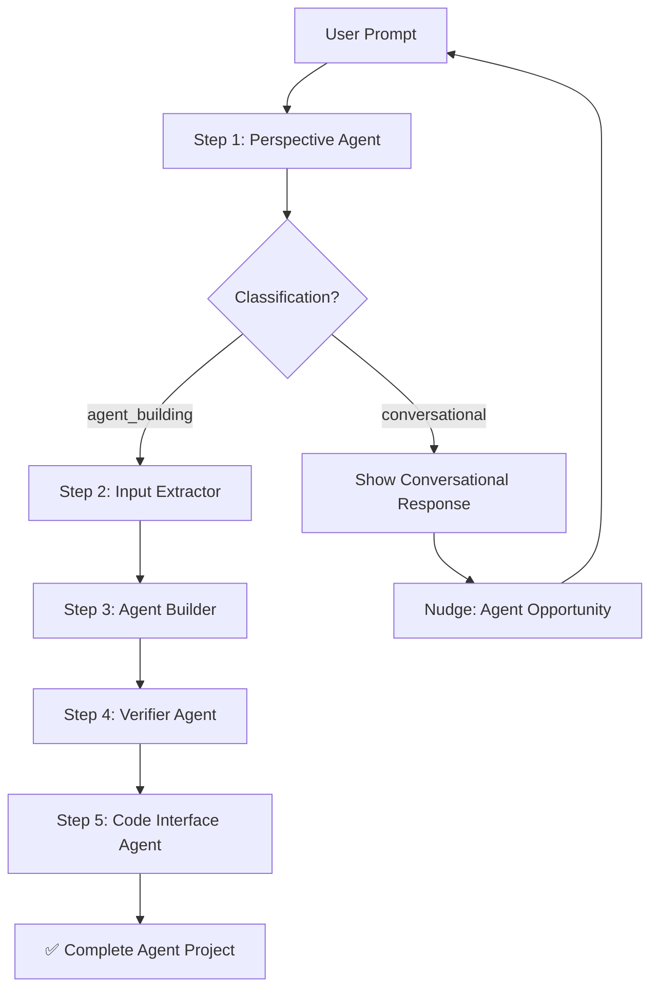

# 🚀 AgentForge — Configuration-Driven Agentic System

## Complete Project Analysis & Documentation

> **Generated:** 2026-04-25  
> **Project Root:** `d:\responsible AI newww\`  
> **Status:** Active  

---

## Table of Contents

1. [PRD — Product Requirements Document](#1-prd--product-requirements-document)
   - [1.1 Project Identity](#11-project-identity)
   - [1.2 Functional Requirements](#12-functional-requirements)
   - [1.3 Non-Functional Requirements](#13-non-functional-requirements)
2. [Workflow — Pipeline Overview](#2-workflow--pipeline-overview)
   - [2.1 Pipeline Steps](#21-pipeline-steps)
   - [2.2 Routing Logic](#22-routing-logic)
3. [Architecture](#3-architecture)
   - [3.1 Backend Agents](#31-backend-agents)
   - [3.2 Shared Utilities](#32-shared-utilities)
   - [3.3 Pipeline Orchestrator](#33-pipeline-orchestrator)
   - [3.4 Web Server](#34-web-server)
   - [3.5 Frontend Application](#35-frontend-application)
4. [API Endpoints](#4-api-endpoints)
5. [Data Flow & Artifacts](#5-data-flow--artifacts)
6. [Technology Stack](#6-technology-stack)
   - [6.1 Backend](#61-backend)
   - [6.2 Frontend](#62-frontend)
   - [6.3 LLM Configuration](#63-llm-configuration)
7. [Configuration](#7-configuration)
   - [7.1 Environment Variables](#71-environment-variables)
   - [7.2 CLI Arguments](#72-cli-arguments)
   - [7.3 Pipeline Constants](#73-pipeline-constants)
8. [Specification Extraction Details](#8-specification-extraction-details)
   - [8.1 Default Values](#81-default-values)
   - [8.2 Extraction Categories](#82-extraction-categories)
9. [Code Generation Details](#9-code-generation-details)
   - [9.1 Output Files](#91-output-files)
   - [9.2 Capability Hints](#92-capability-hints)
   - [9.3 Code Cleaning Pipeline](#93-code-cleaning-pipeline)
   - [9.4 Validation Checks](#94-validation-checks)
10. [Frontend Details](#10-frontend-details)
    - [10.1 UI Layout](#101-ui-layout)
    - [10.2 UI Features](#102-ui-features)
    - [10.3 Design System](#103-design-system)
11. [Project Setup](#11-project-setup)
    - [11.1 Installation](#111-installation)
    - [11.2 Running the Project](#112-running-the-project)
12. [File Inventory](#12-file-inventory)
13. [Project Metrics](#13-project-metrics)

---

## 1. PRD — Product Requirements Document

### 1.1 Project Identity

| Item | Description | Technical Details |
|------|-------------|-------------------|
| **Project Name** | AgentForge — Configuration-Driven Agentic System | An end-to-end AI-powered pipeline that takes a natural-language prompt from a user, classifies the intent, extracts structured agent specifications, generates complete Python agent code, verifies it, and produces documentation — all orchestrated automatically. |
| **Project Type** | Multi-Agent Pipeline + Web Application | Backend pipeline of 5 specialized AI agents orchestrated sequentially, with a Flask web server and a modern dark-themed frontend UI for interactive use. |
| **Primary Goal** | Automate AI agent code generation from natural language | Users describe an agent in plain English; the system produces a complete, runnable Python project (`agent.py`, `main.py`, `requirements.txt`, `README.md`) with AI-based verification and documentation. |
| **Target Users** | Developers; AI enthusiasts; non-technical users wanting custom agents | Anyone who wants to quickly prototype or generate an AI agent without writing code manually. |
| **LLM Provider** | Groq Cloud API | Uses Groq's hosted LLM inference with model `llama-3.3-70b-versatile` for all AI operations: classification, extraction, code generation, verification, and documentation. |
| **Architecture Style** | Sequential Multi-Agent Pipeline | Five specialized agents run in order, each producing an artifact consumed by the next. Pipeline supports skip-on-failure and start-from-step options. |

---

### 1.2 Functional Requirements

| ID | Requirement | Technical Details | Input | Output | File |
|----|-------------|-------------------|-------|--------|------|
| **FR-01** | **Prompt Classification** — System must classify user input as `agent_building` or `conversational` | Uses Groq LLM with a structured classification prompt. Returns JSON with classification, user_text, confidence (high/medium/low), and reason. | Raw user text | `{classification, user_text, confidence, reason}` | `perspective_agent.py` |
| **FR-02** | **Conversational Responses** — For non-building queries, system must provide knowledgeable answers with agent suggestions | When classified as `conversational`, a second LLM call generates an informative answer plus an "Agent Opportunity" suggestion to nudge users toward building. | User question | Conversational response text + agent suggestion | `perspective_agent.py` |
| **FR-03** | **Specification Extraction** — Extract structured agent specifications from natural language | Extracts 4 categories via parallel LLM calls: `core_specifications`, `technical_requirements`, `behavioral_traits`, `integration_needs`. Applies intelligent defaults for missing values. | Plain text agent description | Structured JSON with 20+ agent specification fields | `inputextractor.py` |
| **FR-04** | **Language Auto-Selection** — Automatically determine the best programming language for the agent | A dedicated LLM prompt analyzes the user's requirements to select the most appropriate language. Defaults to Python if no clear language is specified. | Agent description text | `{language, reason}` | `inputextractor.py` |
| **FR-05** | **Code Generation** — Generate complete, production-ready Python agent code | Generates 4 files via focused, individual Groq calls: `agent.py` (main logic), `main.py` (entry point), `requirements.txt` (dependencies), `README.md` (documentation). Includes retry logic (3 attempts) and output cleaning. | `final_agent.json` specification | 4 files in `generated_agent/` folder | `agentbuild.py` |
| **FR-06** | **Code Verification** — AI-based review of generated code against specification | Sends both the specification JSON and generated code to Groq for structured review. Returns `correctness_percentage`, `implemented_correctly`/`partially`/`not_implemented` lists, issues, and summary. | `final_agent.json` + generated code | `verifier_result.json` with score and issues | `verifier.py` |
| **FR-07** | **Documentation Generation** — Produce a comprehensive markdown report of the generated agent | Reads all 4 generated files, sends each to Groq for AI analysis, generates step-by-step run instructions, and assembles a full markdown report. | `generated_agent/` folder contents | `output.md` report | `code_interface_agent.py` |
| **FR-08** | **Web Interface** — Interactive web UI for pipeline execution and artifact viewing | Flask-served dark-mode UI with chat interface, real-time pipeline status tracking, tabbed artifact viewer (Report/agent.py/main.py/requirements.txt/README.md/Spec JSON), and prompt history sidebar. | User interactions via browser | Visual pipeline feedback + downloadable artifacts | `server.py` + `frontend/` |
| **FR-09** | **Input History** — Persist all user prompts with timestamps in CSV format | Every prompt is appended to `input.csv` with ISO timestamp. Frontend sidebar displays history in reverse chronological order with click-to-reuse. | User prompts | `input.csv` with `timestamp` + `user_input` columns | `main.py` / `server.py` |
| **FR-10** | **Input Validation** — Validate and sanitize all user inputs | Min 3 chars, max 5000 chars. Basic prompt injection sanitization (strips "system prompt", "ignore previous", "you are now" patterns). | Raw user input | Validated/sanitized text | `perspective_agent.py` |

---

### 1.3 Non-Functional Requirements

| ID | Requirement | Technical Details | File |
|----|-------------|-------------------|------|
| **NFR-01** | **Resilience** — Pipeline should handle failures gracefully | `--skip-on-failure` flag continues pipeline even if a step fails. Verifier step is non-fatal in web mode. Retry logic on Groq API calls (3 attempts). | `main.py` / `agentbuild.py` |
| **NFR-02** | **Code Quality** — Generated code must follow best practices | System prompts enforce PEP 8, type hints, docstrings, logging over print, SOLID principles, proper error handling, and no hardcoded secrets. | `agentbuild.py` |
| **NFR-03** | **Security** — No secrets in generated code; safe API key handling | All API keys loaded from environment via `python-dotenv`. Generated code has regex-based secret stripping. `.env` excluded from git via `.gitignore`. | `.env` / `.gitignore` |
| **NFR-04** | **Performance** — Pipeline completes within reasonable time | Each Groq API call configured with specific `max_tokens` limits (512–4096). Web server uses threading for async pipeline execution. 180–300s timeouts per step. | `server.py` |

---

## 2. Workflow — Pipeline Overview

### 2.1 Pipeline Steps

```
User Prompt
    │
    ▼
┌──────────────────────────────────────────────────────────────┐
│  Step 0 │ Save Input        │ text → input.csv               │
├──────────────────────────────────────────────────────────────┤
│  Step 1 │ Perspective Agent │ text → build_agent_output.json  │
│          │                   │    OR  conversational_output    │
├──────────────────────────────────────────────────────────────┤
│  Step 2 │ Input Extractor   │ build_agent_output.json         │
│          │                   │    → final_agent.json           │
├──────────────────────────────────────────────────────────────┤
│  Step 3 │ Agent Builder     │ final_agent.json                │
│          │                   │    → generated_agent/           │
├──────────────────────────────────────────────────────────────┤
│  Step 4 │ Verifier Agent    │ generated_agent/                │
│          │                   │    → verifier_result.json       │
├──────────────────────────────────────────────────────────────┤
│  Step 5 │ Code Interface    │ generated_agent/                │
│          │                   │    → output.md                  │
└──────────────────────────────────────────────────────────────┘
```

| Step | Name | Description | Input | Output | File |
|------|------|-------------|-------|--------|------|
| **Step 0** | Save Input | User prompt is saved to `input.csv` with timestamp | User text input | `input.csv` (appended) | `main.py → save_input_to_csv()` |
| **Step 1** | Perspective Agent | Classify user input and route to appropriate path. Calls Groq to classify as `agent_building` → continue pipeline, or `conversational` → show answer and loop back. Robust JSON extraction with 5-level fallback. | User text input | `build_agent_output.json` OR `conversational_output.json` | `perspective_agent.py` |
| **Step 2** | Input Extractor | Extract structured agent specifications from plain text. Makes 4 separate Groq calls to extract: core specs (name, purpose, capabilities, domain), technical requirements (language, framework, DB), behavioral traits (tone, personality), and integration needs (APIs, systems). Merges results and applies defaults. | `build_agent_output.json` | `final_agent.json` | `inputextractor.py` |
| **Step 3** | Agent Builder | Generate complete Python project from specification. Makes 4 focused Groq calls (one per file). Applies code cleaning: strips markdown fences, removes preamble prose, deduplicates imports, removes accidental secrets. Validates output structure. | `final_agent.json` | `generated_agent/{agent.py, main.py, requirements.txt, README.md}` | `agentbuild.py` |
| **Step 4** | Verifier Agent | AI-based correctness review of generated code. Sends `agent.py` + `main.py` + spec JSON to Groq. Returns structured review with `correctness_percentage`, lists of correctly/partially/not implemented items, issues, and a summary. PASS/FAIL threshold at 60%. | `generated_agent/` + `final_agent.json` | `verifier_result.json` | `verifier.py` |
| **Step 5** | Code Interface Agent | Generate comprehensive documentation report. Reads all 4 files from `generated_agent/`, sends each to Groq for analysis, generates step-by-step run instructions, and assembles a full markdown report with AI analysis + raw source code. | `generated_agent/` folder | `output.md` | `code_interface_agent.py` |

---

### 2.2 Routing Logic



| Route | Description | Technical Details |
|-------|-------------|-------------------|
| **Agent Building Route** | Pipeline proceeds through all 5 steps | When `classification = agent_building`, the pipeline runs Steps 2–5 sequentially, generating the complete agent project. |
| **Conversational Route** | Pipeline short-circuits after Step 1 | When `classification = conversational`, a Groq call generates an informative answer + Agent Opportunity suggestion. Steps 2–5 are skipped. User is prompted to submit a building request. |

---

## 3. Architecture

### 3.1 Backend Agents

| Agent | Step | Description | Technical Details | Lines |
|-------|------|-------------|-------------------|-------|
| **Perspective Agent** | Step 1 | Intent classifier and router | Uses `CLASSIFICATION_PROMPT` to determine if user wants to build an agent or asks a question. Robust JSON extraction: direct parse → regex → keyword fallback → default. For conversational queries, generates answer with `CONVERSATIONAL_PROMPT`. | 352 |
| **Input Extractor** | Step 2 | Structured specification extractor | `AdvancedAgentExtractor` class with 4 extraction categories via separate LLM calls. `build_simple_agent_json()` merges results with `DEFAULTS` dict for 20+ fields. Includes interactive `confirm_and_edit` loop (CLI mode only). | 344 |
| **Agent Builder** | Step 3 | Code generator using focused LLM calls | `CodeGeneratorAgent` class generates 4 files with dedicated system prompts. `clean_output()` strips markdown fences, prose, duplicate imports, and secrets. `validate_output()` checks for class definitions, `__init__`, and unassigned self attributes. Uses capability-to-library hints mapping (`_CAP_HINTS`). | 649 |
| **Verifier Agent** | Step 4 | AI-based code reviewer | Sends spec JSON + `agent.py` + `main.py` to Groq with `SYSTEM_VERIFIER` prompt. Expects structured JSON response with `correctness_percentage` (0–100). PASS threshold = 60%. | 143 |
| **Code Interface Agent** | Step 5 | Documentation generator | Reads 4 expected files from `generated_agent/`, sends each to Groq for analysis, generates run instructions separately, and assembles markdown report with file analyses, raw source, and run instructions. | 274 |

---

### 3.2 Shared Utilities

| File | Description | Technical Details |
|------|-------------|-------------------|
| **`groq_utils.py`** (103 lines) | Centralized Groq API utilities | Provides: `require_groq_api_key()`, `groq_client()`, `groq_chat()` for plain text responses, `groq_chat_json()` for JSON-parsed responses. `_extract_first_json_object()` robustly extracts JSON from LLM output, handling code fences and trailing commas. Default model: `llama-3.3-70b-versatile`. |

---

### 3.3 Pipeline Orchestrator

| File | Description | Technical Details |
|------|-------------|-------------------|
| **`main.py`** (572 lines) | CLI pipeline orchestrator | Runs all 5 steps sequentially with colored console output. Features: `argparse` CLI (`--input`, `--input-file`, `--skip-on-failure`, `--start-from`), pre-flight script validation, conversational loop (re-prompts user after conversational responses), final summary with pass/fail status and timing. |

---

### 3.4 Web Server

| File | Description | Technical Details |
|------|-------------|-------------------|
| **`server.py`** (406 lines) | Flask web server for frontend + REST API | Serves static frontend from `./frontend`. Exposes REST API: `POST /api/generate` (start pipeline), `GET /api/status/<id>` (poll job), `GET /api/result/<id>` (fetch artifacts), `GET /api/history` (list past prompts). Runs pipeline in background thread. Manages per-job state in memory (`jobs` dict). |

---

### 3.5 Frontend Application

| File | Description | Technical Details |
|------|-------------|-------------------|
| **`frontend/`** (3 files) | Modern dark-mode web UI (Cursor-inspired) | `index.html` (121 lines), `app.js` (340 lines), `style.css` (237 lines). Split-panel layout: left chat + right pipeline/artifacts. Real-time pipeline status polling (1.2s interval). Tabbed artifact viewer for all generated files. History sidebar with click-to-reuse. Toast notifications. |

---

## 4. API Endpoints

| Method | Endpoint | Description | Request | Response |
|--------|----------|-------------|---------|----------|
| `POST` | `/api/generate` | Start a new pipeline job | `{prompt: string}` — Validates prompt (3–5000 chars). Creates job with UUID, spawns background thread. | `{job_id: string, status: "running"}` |
| `GET` | `/api/status/<job_id>` | Poll pipeline job status | `job_id` (URL param) | `{id, status, route, current_step, steps[], error}` — Returns current job state: status (`running`/`done`/`error`), route, current_step (0–5), steps array with individual statuses. |
| `GET` | `/api/result/<job_id>` | Fetch final pipeline artifacts | `job_id` (URL param) | Full result object with `classification`, `agent_spec`, `verifier_result`, `conversational_response`, generated `files` content, `output_md` report, and `next_step_hint` for conversational routes. |
| `GET` | `/api/history` | Get prompt history from `input.csv` | None | `[{timestamp, prompt}]` (max 50 entries) — Reads `input.csv`, returns last 50 entries in reverse chronological order. |

---

## 5. Data Flow & Artifacts

```
User Prompt
    │
    ├──► input.csv                          (append-only log)
    │
    ▼
build_agent_output.json  ─── OR ───  conversational_output.json
    │                                        │
    ▼                                        ▼
final_agent.json                       (show response, loop)
    │
    ▼
generated_agent/
    ├── agent.py
    ├── main.py
    ├── requirements.txt
    └── README.md
    │
    ▼
verifier_result.json
    │
    ▼
output.md
```

| Artifact | Description | Technical Details |
|----------|-------------|-------------------|
| **`input.csv`** | User prompt log | Columns: `timestamp` (ISO 8601), `user_input` (text). Append-only. Created automatically on first prompt. |
| **`build_agent_output.json`** | Perspective agent output (agent_building route) | Contains: `route`, `classification`, `user_text`, `confidence`, `reason`, `original_input`. Produced only when `classification = agent_building`. |
| **`conversational_output.json`** | Perspective agent output (conversational route) | Contains: `route`, `classification`, `user_text`, `conversational_response`, `confidence`, `reason`, `original_input`. Produced only when `classification = conversational`. |
| **`final_agent.json`** | Extracted agent specification | 20+ fields including: `user input`, `agent_name`, `primary_purpose`, `capabilities[]`, `domain`, `language`, `framework`, `api_integrations[]`, `database`, `tone`, `personality[]`, `external_apis[]`, etc. Defaults applied for missing values. |
| **`generated_agent/`** | Complete generated Python project | Contains 4 files: `agent.py` (main agent class with all capabilities), `main.py` (entry point), `requirements.txt` (pinned dependencies), `README.md` (full documentation). |
| **`verifier_result.json`** | Verification report | Contains: `ai_review` (`correctness_percentage`, `implemented_correctly[]`, `implemented_partially[]`, `not_implemented[]`, `issues[]`, `summary`), `overall_correctness_percentage`, `threshold` (60), `overall_status` (`PASS`/`FAIL`). |
| **`output.md`** | Final documentation report | Markdown report with: generation metadata, files detected, run instructions, per-file AI analysis + raw source code. Generated by `code_interface_agent.py`. |

---

## 6. Technology Stack

### 6.1 Backend

| Technology | Role | Details | Dependency |
|------------|------|---------|------------|
| **Python** | Primary backend language | Python 3.x used for all backend agents, pipeline orchestration, and web server. | — |
| **Flask** | Web framework for REST API + static file serving | Flask 3.0+ with Flask-CORS for cross-origin support. Serves frontend static files and exposes REST API endpoints. Runs on port 5000. | `flask>=3.0.0`, `flask-cors>=4.0.0` |
| **Groq SDK** | LLM inference API client | Python SDK for Groq cloud API. Used for all AI operations via chat completions endpoint with model `llama-3.3-70b-versatile`. | `groq>=0.9.0` |
| **python-dotenv** | Environment variable management | Loads `GROQ_API_KEY` and other secrets from `.env` file. Used across all modules with `find_dotenv()` and `override=True`. | `python-dotenv>=1.0.0` |

### 6.2 Frontend

| Technology | Role | Details |
|------------|------|---------|
| **HTML5** | Page structure | Single-page application with semantic HTML5. 121 lines. Includes sidebar, main content area with chat and pipeline panels, tabbed artifact viewer. |
| **Vanilla CSS** | Styling | 237 lines of dark-mode Cursor-inspired CSS. Uses CSS custom properties, glassmorphism effects, radial gradients, `backdrop-filter: blur(10px)`. Fonts: Inter (sans) + JetBrains Mono (mono). |
| **Vanilla JavaScript** | Client-side logic | 340 lines in IIFE module. Handles: API communication, polling (1.2s interval), pipeline visualization, chat interface, tab switching, history management, toast notifications, server health check. |

### 6.3 LLM Configuration

| Parameter | Value | Details |
|-----------|-------|---------|
| **Model** | `llama-3.3-70b-versatile` | Groq-hosted Meta Llama 3.3 70B model. Used for all AI tasks with varying temperatures: classification (0.0), extraction (0.0), code generation (0.1), verification (0.0), analysis (0.2), conversation (0.7). |
| **Token Limits** | Varies by task | Classification: 512 tokens · Extraction: 900 tokens/category · Code generation: 4096 tokens/file · Verification: 1024 tokens · Analysis: 900 tokens/file · Run instructions: 1000 tokens |

---

## 7. Configuration

### 7.1 Environment Variables

| Variable | Description | Required? |
|----------|-------------|-----------|
| **`GROQ_API_KEY`** | Groq Cloud API authentication key. Used by all agents for LLM inference. Loaded from `.env` file via `python-dotenv`. | ✅ Required |
| **`GROQ_MODEL`** | Optional model override. Defaults to `llama-3.3-70b-versatile`. Can be overridden to use a different Groq model. | ❌ Optional |

### 7.2 CLI Arguments

| Argument | Description | Default |
|----------|-------------|---------|
| `--input` / `-i` | Text prompt describing the agent to build. Mutually exclusive with `--input-file`. | Interactive prompt |
| `--input-file` / `-f` | Path to a `.txt` file containing the prompt. Mutually exclusive with `--input`. | None |
| `--skip-on-failure` | Continue pipeline even if a step fails. | `False` |
| `--start-from` | Resume pipeline from a specific step (1–5). Skips earlier steps. | `1` |

### 7.3 Pipeline Constants

| Constant | Value | Location | Description |
|----------|-------|----------|-------------|
| `THRESHOLD` | `60` | `verifier.py` | Verifier pass/fail threshold. If `correctness_percentage >= 60`, `overall_status = PASS`. |
| `MAX_RETRIES` | `3` | `agentbuild.py` | Code generation retry count. Agent builder retries each file generation up to 3 times on `RuntimeError`. |
| `MAX_INPUT_LENGTH` | `5000` | `perspective_agent.py` | Maximum user input length in characters. |
| `MIN_INPUT_LENGTH` | `3` | `perspective_agent.py` | Minimum user input length in characters. |

---

## 8. Specification Extraction Details

### 8.1 Default Values

When the user does not explicitly mention a field, these defaults are applied:

| Field | Default Value |
|-------|---------------|
| `agent_name` | `AutoAgent` |
| `primary_purpose` | `General assistant` |
| `language` | `Python` |
| `framework` | `None` |
| `database` | `json_file` |
| `cloud_platform` | `local` |
| `tone` | `neutral` |
| `personality` | `[helpful]` |
| `emotional_intelligence` | `medium` |
| `security` | `basic` |
| `performance` | `normal` |
| `storage` | `json_file` |
| `memory` | `in_memory` |
| `decision_authority` | `assist only` |
| `target_users` | `general users` |
| `domain` | `general` |
| `content_types` | `[text]` |

### 8.2 Extraction Categories

| Category | Fields Extracted | Notes |
|----------|-----------------|-------|
| **Core Specifications** | Agent Name, Primary Purpose, Capabilities, Target Users, Domain, Content Types, Decision Authority | Extracted via dedicated LLM prompt with strict JSON output format. |
| **Technical Requirements** | Programming Language, Framework, APIs, Database, Cloud Platform, Performance, Security, Storage, Memory, Tools | Framework validation: non-web frameworks (pandas, numpy) are moved to `third_party_tools`. |
| **Behavioral Traits** | Tone, Personality, Emotional Intelligence | Conservative extraction — only uses values explicitly stated in user input. |
| **Integration Needs** | External APIs, Internal Systems, Database Connections | Conservative extraction with emphasis: "Never create new information not explicitly present." |

---

## 9. Code Generation Details

### 9.1 Output Files

| File | Description | Technical Details |
|------|-------------|-------------------|
| **`agent.py`** | Main agent class with all capabilities | Follows strict structure: stdlib imports → third-party imports → constants → class with `__init__` → capability methods → utility methods → `run()` method → `if __name__` block. All methods fully implemented, no stubs. |
| **`main.py`** | Application entry point | Imports agent class, handles CLI args via `argparse`, configures logging, implements proper error handling. Framework-aware: FastAPI → uvicorn, Flask → `app.run()`, standalone → `asyncio`. |
| **`requirements.txt`** | Python package dependencies | Sorted alphabetically with `>=` version pinning. Always includes `python-dotenv>=1.0.0`. Auto-detected from capabilities, framework, database, and API specifications. |
| **`README.md`** | Project documentation | Includes: title, description, features, prerequisites, installation steps, how to run, capabilities list, and example usage. |

### 9.2 Capability Hints

The system maps user-requested capabilities to concrete library implementations:

| Capability | Library | Hint |
|-----------|---------|------|
| CSV reading | `csv` (stdlib) | `open(path,'r')`, `csv.DictReader(f)` to read rows. |
| Named entity extraction | `spaCy` | `spacy.load('en_core_web_sm')` → `doc=nlp(text)` → iterate `doc.ents`. |
| Web scraping | `requests` + `BeautifulSoup4` | `requests.get(url)`, `BeautifulSoup(resp.content,'html.parser')`. |
| LLM integration | `Groq SDK` | `Groq(api_key=os.getenv('GROQ_API_KEY'))` → `client.chat.completions.create()`. |
| PDF processing | `PyPDF2` | `PyPDF2.PdfReader(path)` → `page.extract_text()`. |
| Email sending | `smtplib` (stdlib) | `smtplib` and `email.mime` for sending emails. |
| File monitoring | `watchdog` | `Observer` + `FileSystemEventHandler` for filesystem events. |
| Summarization | `spaCy` / `nltk` | Extractive summarization using NLP libraries. |

### 9.3 Code Cleaning Pipeline

Generated code passes through 4 cleaning stages:

| Stage | Description | Technical Details |
|-------|-------------|-------------------|
| **1. Markdown fence removal** | Strips ` ```python ` and ` ``` ` blocks from LLM output | Regex: `^```[\w]*\n?` and `\n?```$` |
| **2. Prose stripping** | Removes preamble/trailing commentary | Regex detects lines starting with: "sure", "here's", "certainly", "this is", "the above", etc. |
| **3. Import deduplication** | Removes duplicate import statements | Normalizes import lines, tracks seen set, keeps only first occurrence. |
| **4. Secret removal** | Strips hardcoded API keys from generated code | Regex: `sk-[a-zA-Z0-9]{20+}` and `api_key='...'` patterns replaced with `os.getenv('API_KEY')`. |

### 9.4 Validation Checks

After generation, code is validated:

| Check | Description | Action |
|-------|-------------|--------|
| **Class definition** | `agent.py` must contain `class ` keyword | Logs warning if no class definition found. |
| **`__init__` method** | `agent.py` must contain `def __init__` method | Logs warning if no `__init__` method found. |
| **Unassigned self attributes** | Detects `self.x` used but not assigned in `__init__` | Regex-based analysis compares assigned vs used self attributes. Logs warning for potential `AttributeError`. |
| **Requirements validation** | `requirements.txt` must not be empty | Logs warning if empty; logs count of packages otherwise. |

---

## 10. Frontend Details

### 10.1 UI Layout

| Component | Description | Technical Details |
|-----------|-------------|-------------------|
| **Sidebar** | Left sidebar with branding, history, and server status | 320px width. Contains: AgentForge logo/branding, scrollable prompt history, server status pill (Online/Offline), usage tip hint. |
| **Chat Panel** | Left main panel for conversation | Split-panel left side (1.15fr). Chat messages: user (cyan tint, right-aligned), assistant (purple tint, left-aligned), system (centered, muted). Scrollable chat area with composer at bottom. |
| **Pipeline Panel** | Right panel showing pipeline + artifacts | Split-panel right side (0.85fr). Top: 5-step pipeline status cards (pending/running/done/error/skipped). Bottom: tabbed artifact viewer with 6 tabs. |
| **Composer** | Input area for user prompts | Textarea (3 rows, 5000 char max) with character counter. Submit via "Run" button or `Ctrl+Enter`. Disabled during pipeline execution. |

### 10.2 UI Features

| Feature | Description | Technical Details |
|---------|-------------|-------------------|
| **Real-time Polling** | Pipeline status updates every 1.2 seconds | `setInterval`-based polling of `/api/status/<job_id>`. Updates pipeline step cards (border color changes: cyan=running, green=done, red=error). Auto-stops on done/error. |
| **Tabbed Artifact Viewer** | 6 tabs for viewing generated artifacts | Tabs: Report (`output.md`), `agent.py`, `main.py`, `requirements.txt`, `README.md`, Spec JSON. Content displayed in monospace `pre` blocks. Auto-populated on pipeline completion. |
| **Prompt History** | Clickable history items in sidebar | Loaded from `/api/history` on init. Last 50 prompts shown. Click to auto-fill prompt textarea. Timestamps shown in locale format. |
| **Toast Notifications** | Ephemeral notification popups | Bottom-right positioned. 3 types: info (cyan border), error (red border), success (green border). Auto-dismiss after 4.5 seconds. |
| **Route Badge** | Shows current classification route | Displayed in chat panel header. Shows "Conversational" or "Agent Building" badge based on perspective agent classification. |

### 10.3 Design System

| Element | Details |
|---------|---------|
| **Color Palette** | Background: `#0b0f17` · Panel: `#0f1524` · Text: `#e6eaf2` · Accent Cyan: `#6ee7ff` · Accent Purple: `#a78bfa` · Good: `#22c55e` · Warn: `#f59e0b` · Bad: `#ef4444` |
| **Typography** | **Inter** (sans-serif) for UI text (weights 300–700), **JetBrains Mono** (monospace) for code display (weights 300–600). Font size: 11–14px. Line height: 1.35–1.55. |
| **Visual Effects** | Body: dual radial gradients (cyan at 15% 10%, purple at 75% 0%). Sidebar: linear gradient overlay. Topbar: `backdrop-filter: blur(10px)`. Panels: gradient backgrounds with glass-like transparency. |

---

## 11. Project Setup

### 11.1 Installation

| Step | Action | Command |
|------|--------|---------|
| 1 | Clone the repository | `git clone <repo-url> && cd "responsible AI newww"` |
| 2 | Create Python virtual environment | `python -m venv venv && venv\Scripts\activate` (Windows) |
| 3 | Install dependencies | `pip install -r requirements.txt` |
| 4 | Configure environment variables | Copy `.env.example` to `.env` and add `GROQ_API_KEY` from [Groq Cloud dashboard](https://console.groq.com) |

### 11.2 Running the Project

| Mode | Command | Description |
|------|---------|-------------|
| **CLI Mode** | `python main.py --input "Build me an agent that ..."` | Interactive pipeline via command line. Options: `--skip-on-failure`, `--start-from <1-5>`. |
| **CLI Mode (interactive)** | `python main.py` | Prompts for input interactively (press Enter twice to submit). |
| **Web Mode** | `python server.py` | Starts Flask server at `http://localhost:5000`. Frontend auto-loads. Enter prompts in chat and watch pipeline execute in real-time. |

---

## 12. File Inventory

### Root Files

| File | Description | Size |
|------|-------------|------|
| `main.py` | Pipeline orchestrator (CLI) | 572 lines · 23,690 bytes |
| `perspective_agent.py` | Step 1 — Intent classifier | 352 lines · 13,917 bytes |
| `inputextractor.py` | Step 2 — Spec extractor | 344 lines · 8,795 bytes |
| `agentbuild.py` | Step 3 — Code generator | 649 lines · 26,778 bytes |
| `verifier.py` | Step 4 — Code verifier | 143 lines · 4,642 bytes |
| `code_interface_agent.py` | Step 5 — Documentation generator | 274 lines · 8,225 bytes |
| `groq_utils.py` | Shared Groq API utilities | 103 lines · 2,688 bytes |
| `server.py` | Flask web server | 406 lines · 13,131 bytes |
| `requirements.txt` | Python dependencies | 5 lines · 64 bytes |
| `.env.example` | Environment variable template | 3 lines · 26 bytes |
| `.gitignore` | Git ignore rules | 35 lines · 393 bytes |
| `input.csv` | Prompt history log | 49 lines · 5,397 bytes |

### Frontend Files

| File | Description | Size |
|------|-------------|------|
| `frontend/index.html` | Main HTML page | 121 lines · 4,504 bytes |
| `frontend/app.js` | Client-side JavaScript | 340 lines · 10,462 bytes |
| `frontend/style.css` | Stylesheet (dark mode) | 237 lines · 7,577 bytes |

### Generated Agent Files (Sample Output)

| File | Description | Size |
|------|-------------|------|
| `generated_agent/agent.py` | LangGraphAgent class for CSV→JSON extraction | 85 lines · 2,944 bytes |
| `generated_agent/main.py` | Async main loop with agent initialization | 27 lines · 625 bytes |
| `generated_agent/README.md` | langgraph agent documentation | 47 lines · 2,439 bytes |

---

## 13. Project Metrics

| Metric | Value | Breakdown |
|--------|-------|-----------|
| **Total Backend Lines** | ~2,843 lines | `main.py`(572) + `perspective_agent`(352) + `inputextractor`(344) + `agentbuild`(649) + `verifier`(143) + `code_interface`(274) + `groq_utils`(103) + `server`(406) |
| **Total Frontend Lines** | ~698 lines | `index.html`(121) + `app.js`(340) + `style.css`(237) |
| **Total Source Files** | 15 files | 11 core source files + 4 generated agent files |
| **LLM Calls Per Pipeline Run** | ~10–12 Groq API calls | Step 1: 1–2 calls · Step 2: 4 calls · Step 3: 4 calls · Step 4: 1 call · Step 5: 5 calls |
| **Total Codebase Size** | ~3,541 lines | Backend (2,843) + Frontend (698) |
| **Dependencies** | 4 packages | `flask>=3.0.0`, `flask-cors>=4.0.0`, `groq>=0.9.0`, `python-dotenv>=1.0.0` |

---

*This document was auto-generated from `project_analysis.csv` on 2026-04-25.*
